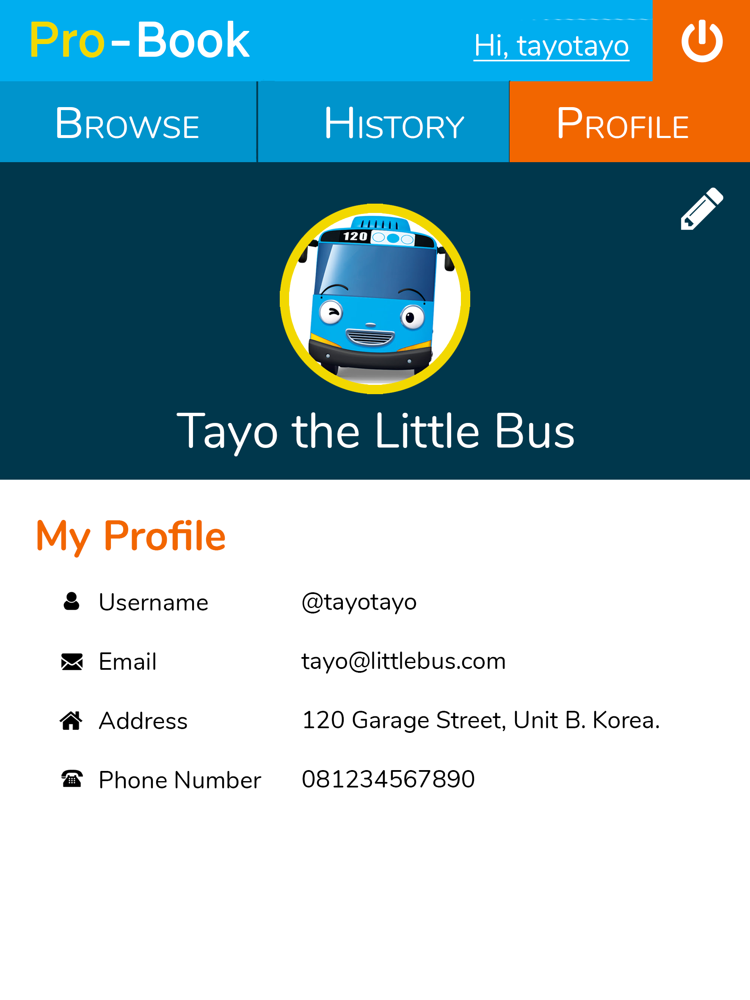

# Pro-Book Bookstore (Tugas 1 IF3110)

## Deskripsi Singkat

Pro-Book Bookstore adalah sebuah aplikasi aplikasi *toko buku online* **berbasis web** yang memungkinkan seorang pengguna untuk membeli dan memberi komentar serta penilaian pada buku. Penilaian dan komentar yang diberikan oleh pengguna diharapkan dapat membantu pengguna lain dalam memilih buku yang akan dibeli. Untuk menggunakan aplikasi ini, pengguna perlu memiliki *akun pribadi*. Aplikasi ini menyediakan fungsi *login* dan *registrasi* sebagai pilihan masuk bagi pengguna ke akun dan fasilitas aplikasi ini.

## Anggota Tim
Pengembang aplikasi terdiri dari 3 orang yaitu:
1. Gloryanson Ginting - 13516060
2. Samuel Sandi Kristianto Lim - 13516069
3. David Timothy Panjaitan - 13516075

## Spesifikasi

### Login

Pengguna dapat melakukan login sebagai user. Identitas pengguna yang sudah login maka akan status login tersebut akan disimpan sebagai cookie dalam browser dan jika cookie ini tidak ada maka pengguna dianggap belum login dan aplikasi akan selalu mengarahkan (*redirect*) pengguna ke halaman ini.

### Register

Pengguna dapat mendaftarkan diri sebagai user agar dapat menggunakan aplikasi ini. Pengguna tidak dapat mendaftarkan diri menggunakan email dan/atau username yang sudah pernah digunakan sebelumnya. **Validasi email dan username dilakukan menggunakan AJAX**. Setelah mendaftarkan diri, pengguna akan secara otomatis login dengan user yang baru didaftarkannya.

### Search-Books

Search-Books merupakan halaman utama yang ditampilkan ketika user telah login. Pada halaman Search-Books, terdapat sebuah input field dapat diisi pengguna untuk melakukan pencarian buku berdasarkan judul.

Setelah pengguna menekan tombol search, pengguna akan dibawa ke halaman Search-Result.

### Search-Result

Pada Search-Result, ditampilkan daftar buku dan jumlah hasil pencarian. Pada tiap entri buku ditampilkan judul, penulis, gambar, potongan sinopsis, serta rating dari buku tersebut. Jika tombol detail ditekan, pengguna akan dibawa ke halaman Book-Detail dari buku yang bersangkutan.

### Book-Detail

Pada halaman ini, ditampilkan detail buku yang terdiri dari judul, penulis, gambar, rating, serta komentar dan rating dari user lain.

Pada halaman ini juga disediakan dropdown untuk memasukkan jumlah buku yang ingin dipesan dan tombol order. Jika tombol order ditekan, proses pemesanan akan dilakukan **menggunakan AJAX**, yang berarti halaman tidak akan di-*refresh* setelah tombol order ditekan. Tidak ada proses pembayaran yang ditangani oleh sistem.

Setelah proses pemesanan selesai dilakukan, akan muncul notifikasi pada browser pengguna. Informasi yang diberikan oleh notifikasi mengikuti contoh.

### Profile

Pada halaman ini, ditampilkan nama lengkap, username, email, alamat, nomor telepon, dan foto profil. Pada bagian kanan atas terdapat tombol edit, jika pengguna menekan tombol tersebut, pengguna dibawa ke halaman Edit-Profile.

### Edit-Profile

Pada halaman ini, pengguna dapat mengubah nama yang ditampilkan, alamat, nomor telepon, dan foto profil.

Pada bagian bawah halaman, terdapat tombol Back dan Save. Jika tombol Back ditekan, pengguna kembali ke halaman Profile tanpa mengubah informasi profilnya. Jika tombol save ditekan, nama dan alamat pengguna akan diganti sesuai input field, dan pengguna dibawa ke halaman Profile.

### History

Pada halaman ini, ditampilkan daftar buku yang sudah pernah dipesan oleh pengguna, diurutkan berdasarkan waktu pemesanan dengan pesanan paling baru merupakan entri paling atas.

Pada tiap entri pada history, terdapat tombol review. Jika tombol review ditekan, pengguna akan dibawa ke halaman Review. Jika pengguna sudah memberikan review untuk order tersebut, tombol review akan hilang dari entri yang bersangkutan.

### Review

Pada halaman ini, pengguna dapat memberikan review untuk buku yang dipesan berupa rating dan komentar. Review yang diberikan dari halaman ini akan muncul pada halaman Book-Detail dari buku yang di-review. Setelah selesai, user akan dibawa kembali ke halaman History.

### Pembagian Tugas

**Tampilan**
1. Login : 13516060
2. Register : 13516069
3. Search-Book : 13516075
4. History : 13516075
5. Review : 13516075
6. Book-detail : 13516075
7. Profile : 13516060
8. Edit-Profile : 13516060

**Fungsionalitas**
1. Login : 13516060
2. Register : 13516069
3. Search-Book : 13516075
4. History : 13516075
5. Review : 13516075
6. Book-detail : 13516075
7. Profile : 13516060
8. Edit-Profile : 13516060

## About

Asisten IF3110 2018

Audry | Erick | Holy | Kevin J. | Tasya | Veren | Vincent H.

Dosen : Yudistira Dwi Wardhana | Riza Satria Perdana | Muhammad Zuhri Catur Candra

